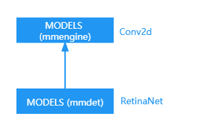
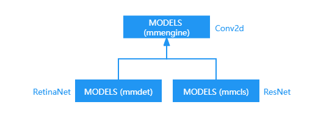

# 注册器（Registry）

**MMEngine** 使用 [注册器](https://mmengine.readthedocs.io/zh_CN/latest/api.html#mmengine.registry.Registry) 管理功能相似的模块, 例如 model, dataset, optimizer 等。

OpenMMLab 大多数的开源项目均使用注册器管理模型、数据集，例如 [MMDetection](https://github.com/open-mmlab/mmdetection), [MMDetection3D](https://github.com/open-mmlab/mmdetection3d), [MMClassification](https://github.com/open-mmlab/mmclassification), [MMEditing](https://github.com/open-mmlab/mmediting) 等。

## 什么是注册器

在 MMEngine 中，注册器可以看作类到字符串的映射。一个注册器中的类通常有相似的接口，但是可以实现不同的算法或支持不同的数据集。借助注册器，用户可以通过使用相应的字符串查找并实例化该类，并根据他们的需要实例化对应模块。

使用注册器管理代码库中的模型，需要以下三个步骤。

1. 创建一个用于实例化类的构建方法（可选，在大多数情况下您可以只使用默认方法）
2. 创建注册器
3. 使用此注册器管理模块

注册器的参数构建方法（build_func）用来自定义如何实例化类的实例，默认使用 [这里](https://mmengine.readthedocs.io/zh_CN/latest/api.html#mmengine.registry.build_from_cfg) 实现的 `build_from_cfg`。

使用注册器管理功能相似的模块有两个优点，一个是无侵入，另一个是灵活组合。如果您对`为什么使用注册器`感兴趣，可以跳至最后一个章节。

## 入门用法

假设我们要实现一系列数据集转换器（Dataset Converter），用于将不同格式的数据转换为标准数据格式。我们希望可以实现仅修改配置就能够使用不同的转换器而无需修改代码。

我们先创建一个名为 `converters` 的目录作为包，在包中我们创建一个文件来实现构建器（builder），

```python
# model/builder.py
from mmengine.registry import Registry
# 创建转换器的注册器
CONVERTERS = Registry('converter')
```

然后我们可以实现不同的转换器。

```python
# converters/converter.py
from .builder import CONVERTERS

# 使用注册器管理模块
@CONVERTERS.register_module()
class Converter1(object):
    def __init__(self, a, b):
        self.a = a
        self.b = b

@CONVERTERS.register_module()
class Converter2(object):
    def __init__(self, a, b, c):
        self.a = a
        self.b = b
        self.c = c
```

使用注册器管理模块的关键步骤是，将实现的模块注册到注册表 `CONVERTERS` 中。通过 `@CONVERTERS.register_module()` 装饰所实现的模块，字符串和类之间的映射就可以由 `CONVERTERS` 构建和维护，我们也可以通过 `CONVERTERS.register_module(module=Converter1)` 实现同样的功能。

通过注册，我们就可以通过 `CONVERTERS` 建立字符串与类之间的映射，

```python
'Converter1' -> <class 'Converter1'>
```

```{note}
只有模块所在的文件被导入时，注册机制才会被触发，所以我们需要在某处导入该文件。
```

模块成功注册后，我们可以通过配置文件使用这个转换器。

```python
# main.py
# 注意，converter_cfg 可以通过解析配置文件得到
converter_cfg = dict(type='Converter1', a=a_value, b=b_value)
converter = CONVERTERS.build(converter_cfg)
```

如果我们想使用 `Converter2`，仅需修改配置。

```python
converter_cfg = dict(type='Converter2', a=a_value, b=b_value, c=c_value)
converter = CONVERTERS.build(converter_cfg)
```

假如我们想在创建实例前检查输入参数的类型（或者任何其他操作），我们可以实现一个构建方法并将其传递给注册器从而实现自定义构建流程。

```python
from mmengine.registry import Registry

# 创建一个构建方法
def build_converter(cfg, registry, *args, **kwargs):
    cfg_ = cfg.copy()
    converter_type = cfg_.pop('type')
    if converter_type not in registry:
        raise KeyError(f'Unrecognized converter type {converter_type}')
    else:
        converter_cls = registry.get(converter_type)

    converter = converter_cls(*args, **kwargs, **cfg_)
    return converter

# 创建一个用于转换器的注册器，并将 `build_converter` 传递给 `build_func` 参数
CONVERTERS = Registry('converter', build_func=build_converter)
```

```{note}
在这个例子中，我们演示了如何使用参数：`build_func` 自定义构建类的实例的方法。
该功能类似于默认的 `build_from_cfg` 方法。在大多数情况下，使用默认的方法就可以了。
```

## 进阶用法

MMEngine 的注册器支持跨项目调用，即可以在一个项目中使用另一个项目的模块。虽然跨项目调用也有其他方法的可以实现，但 MMEngine 注册器提供了更为简便的方法。

为了方便跨库调用，MMEngine 提供了 12 个根注册器：

- RUNNERS: Runner 相关的注册器，如 `EpochBasedRunner`, `IterBasedRunner`
- RUNNER_CONSTRUCTORS: Runner 的构造器
- HOOKS: 钩子，如 `CheckpointHook`, `ProfilerHook`
- DATASETS: 数据集
- SAMPLERS: `Dataloader` 的 `sampler`，用于采样数据
- PIPELINES: 包含各种数据处理，如 `Resize`, `Reshape`
- MODELS: 模型的各种模块
- WEIGHT_INITIALIZERS: 权重初始化的工具
- OPTIMIZERS: 注册了 PyTorch 中所有的 `optimizer` 以及自定义的 `optimizer`
- OPTIMIZER_CONSTRUCTORS:
- TASK_UTILS: 任务强相关的一些组件，如 `AnchorGenerator`, `BboxCoder`

下面我们以 OpenMMLab 开源项目为例介绍如何跨项目调用模块。

## 调用父节点的模块

`MMEngine` 中定义了模块 `Conv2d`，

```python
from mmengine.registry import Registry, MODELS

MODELS.register_module()
class Conv2d(nn.Module):
    pass
```

`MMDetection` 中定义了模块 `RetinaNet`，

```python
from mmengine.registry import Registry, MODELS as MMENGINE_MODELS
# parent 参数表示当前节点的父节点，通过 parent 参数实现层级结构
# scope 参数可以理解为当前节点的标志。如果不传入该参数，则 scope 被推导为当前文件所在
# 包的包名，这里为 mmdet
MODELS = Registry('model', parent=MMENGINE_MODELS, scope='mmdet')

@MMDET_MODELS.register_module()
class RetinaNet(nn.Module):
    pass
```

下图是 `MMEngine`, `MMDetection` 两个项目的注册器层级结构。



我们可以在 `MMDetection` 中调用 `MMEngine` 中模块。

```python
from mmdet.models import MODELS
# 创建 RetinaNet 实例
model = MODELS.build(cfg=dict(type='RetinaNet'))
# 也可以加 mmdet 前缀
model = MODELS.build(cfg=dict(type='mmdet.RetinaNet'))
# 创建 ResNet 实例
model = MODELS.build(cfg=dict(type='mmengine.ResNet'))
# 也可以不加 mmengine 前缀
model = MODELS.build(cfg=dict(type='ResNet'))
```

需要注意的是，如果不加前缀，`build` 方法首先查找当前节点是否存在该模块，如果存在则返回该模块，否则会继续向上查找父节点甚至祖先节点直到找到该模块。因此，如果当前节点和父节点存在同一模块并且希望调用父节点的模块，我们需要指定 `scope` 前缀。

## 调用兄弟节点的模块

除了可以调用父节点的模块，也可以调用兄弟节点的模块。

`MMClassification` 中定义了模块 `ResNet`，

```python
from mmengine.registry import Registry, MODELS
MODELS = Registry('model', parent=MMENGINE_MODELS)

@MODELS.register_module()
class ResNet(nn.Module):
    pass
```

下图是 `MMEngine`, `MMDetection`, `MMClassification` 三个项目的注册器层级结构。




我们可以在 `MMDetection` 中调用 `MMClassification` 定义的模块，

```python
from mmdet.models import MODELS
model = MODELS.build(cfg=dict(type='mmcls.ResNet'))
```

也可以在 `MMClassification` 中调用 `MMDetection` 定义的模块。

```python
from mmcls.models import MODELS
model = MODELS.build(cfg=dict(type='mmdet.RetinaNet'))
```

调用兄弟节点的模块需要指定在 `type` 中指定 `scope` 前缀，如果不想指定，我们可以将 `build` 方法中的 `default_scope` 参数设置为 'mmdet'，它会将 `default_scope` 对应的 `registry` 作为当前 `Registry` 并调用 `build` 方法。

```python
from mmcls.models import MODELS
model = MODELS.build(cfg=dict(type='RetinaNet'), default_scope='mmdet')
```

注册器除了支持两层结构，三层甚至更多层结构也是支持的。

例如 `MMOCR` 会 `MMDetection`

`MMClassification` 中定义了模块 `ResNet`，

```python
from mmengine.model import Registry
from mmdet.model import MODELS as MMDET_MODELS
MODELS = Registry('model', parent=MMDET_MODELS)

@MODELS.register_module()
class FCNet(nn.Module):
    pass
```

下图是 `MMEngine`, `MMDetection`, `MMClassification`, `MMOCR` 四个项目的注册器层级结构。


我们可以在 `MMOCR` 中调用 `MMDetection` 或者 `MMOCR` 中的模块，

```python
from mmocr.model import MODELS
# 也可以不提供 mmdet 前缀，如果在 MMOCR 找不到则会向上在 MMDet 中查找
model = MODELS.build(cfg=dict(type='mmdet.RetinaNet'))
# 调用兄弟节点的模块需提供 mmcls 前缀，也可以设置 default_scope 参数
model = MODELS.build(cfg=dict(type='mmcls.ResNet'))
```

也可以在 `MMClassification` 中调用 `MMOCR` 的模块。

```python
from mmcls.models import MODELS
# 需要注意前缀的顺序，'mmocr.mmdet.ResNet' 是不正确的
model = MODELS.build(cfg=dict(type='mmdet.mmocr.FCNet'))
# 当然，更简单的方法是直接设置 default_scope
model = MODELS.build(cfg=dict(type='FCNet', default_scope='mmocr'))
```

## 为什么使用注册器

使用注册器管理功能相似的模块有两个优点，一个是无侵入，另一个是灵活组合。下面通过例子介绍注册器的两个优点。

### 无侵入

假设实现了一个卷积模块 `Con2d`，

```python
# model/conv.py
import torch.nn as nn

class Conv2d(nn.Module):
    pass
```

我们想在训练中使用该模块，可以在 `train.py` 中导入该模块。

```python
# train.py
from .model import Conv2d

conv = Conv2d()
```

这样看似没有什么问题，但假如添加了新模块 `DeformConv2d`，

```python
# model/conv.py
import torch.nn as nn

class Conv2d(nn.Module):
    pass

class DeformConv2d(nn.Module):
    pass
```

如果需要使用 `DeformConv2d`，就需要在 `train.py` 中导入该模块。

```python
# train.py
from .model import Conv2d, DeformConv2d

conv = DeformConv2d()
```

而如果使用注册器，我们可以避免 `train.py` 文件的改动。

```python
# model/conv.py
from mmengine.registry import Registry, MODELS

import torch.nn as nn

@MODELS.register_module()
class Conv2d(nn.Module):
    pass

@MODELS.register_module()
class DeformConv2d(nn.Module):
    pass
```

```python
# train.py
from mmengine.registry import MODELS

cfg = dict(type='Conv2d')  # 注意，这个配置可以通过解析配置文件得到
conv = MODELS.build(cfg)
```

### 灵活组合

假如我们想将多个模块组合成一个新模块，

```python
# model/conv.py
import torch.nn as nn

class Conv2d(nn.Module):
    pass

class DeformConv2d(nn.Module):
    pass
```
```python
# model/pool.py
import torch.nn as nn

class MaxPool2d(nn.Module):
    pass

class AvgPool2d(nn.Module):
    pass
```

我们可以在 `train.py` 中组合成新的模块 `ConvBlock`，

```python
# train.py
import torch.nn as nn
from .model import Conv2d, MaxPool2d

class ConvBlock(nn.Module):

    def __init__(self):
        self.conv = Conv2d()
        self.pool = MaxPool2d()

    def forward(self, x):
        x = self.conv(x)
        x = self.pool(x)
        return x


conv_blcok = ConvBlock()
```

但是，如果我们想组合 `DeformConv2d` 和 `AvgPool2d`，那无疑要修改对 `ConvBlock` 。

而如果使用注册器，该问题可以轻松解决。

```python
# model/conv.py
import torch.nn as nn
from mmengine.registry import MODELS

@MODELS.registry_module()
class Conv2d(nn.Module):
    pass

@MODELS.registry_module()
class DeformConv2d(nn.Module):
    pass
```

```python
# model/pool.py
import torch.nn as nn
from mmengine.registry import MODELS

@MODELS.registry_module()
class MaxPool2d(nn.Module):
    pass

@MODELS.registry_module()
class AvgPool2d(nn.Module):
    pass
```

```python
# train.py
from mmengine.registry import MODELS

class ConvBlock(nn.Module):

    def __init__(self, conv_cfg, pool_cfg):
        self.conv = MODELS.build(conv_cfg)
        self.pool = MODELS.build(pool_cfg)

    def forward(self, x):
        x = self.conv(x)
        x = self.pool(x)
        return x

# # 注意，conv_cfg 和 pool_cfg 可以通过解析配置文件得到
conv_cfg = dict(type='DeformConv2d')
pool_cfg = dict(type='AvgPool2d')
conv_block = ConvBlock(conv_cfg, pool_cfg)
```
